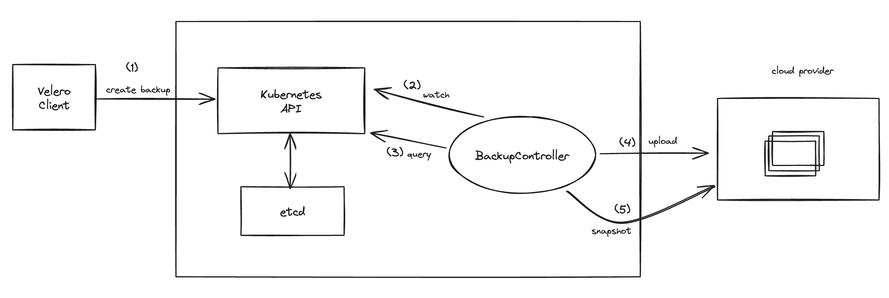
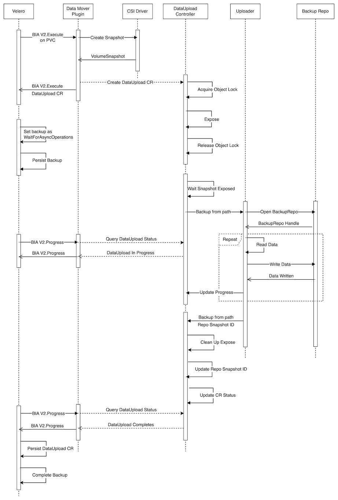
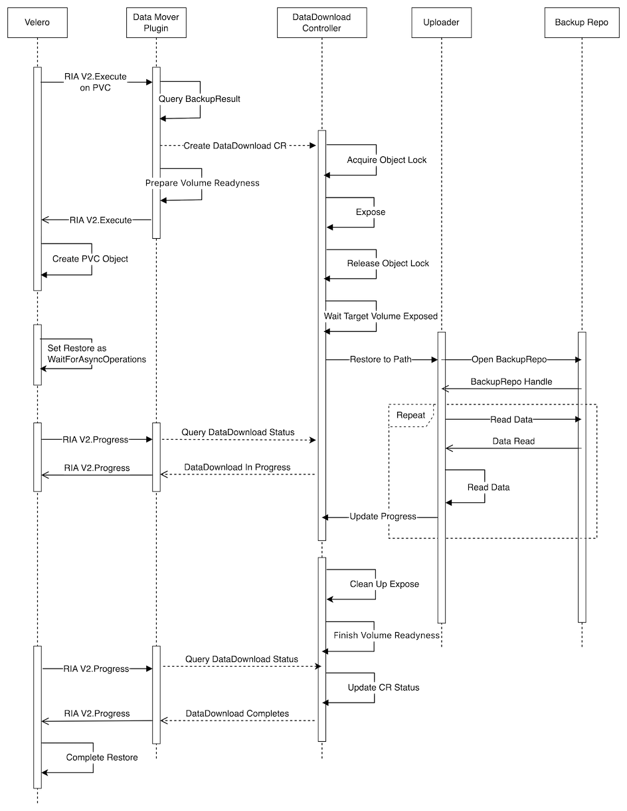

# Velero - Kubernetes集群备份和恢复工具

## 一、简介
Velero 是一款专为 Kubernetes 集群设计的备份和恢复工具，旨在帮助用户确保其应用程序和数据的安全性和可靠性.
备份功能支持备份策略配置、定时备份和增量备份。恢复功能包括整集群恢复、可选资源恢复、持久卷恢复，以及跨集群恢复和定期恢复。

## 二、架构
  

## 三、环境准备

### 3.1、K8s集群资源创建
1. 可通过k8s集群访问的对象存储，并预建备份桶，提供AK\SK；
2. k8s集群预先安装SnapshotController及CSI插件（k8s最低版本v1.20，参考[https://kubernetes-csi.github.io/docs/snapshot-controller.html](https://kubernetes-csi.github.io/docs/snapshot-controller.html)）；
3. k8s集群预先创建的CRD：
    * VolumeSnapshotClass
    * VolumeSnapshotContent
    * VolumeSnapshot

### 3.2、安装velero
下载velero-client包并解压安装
```bash
wget https://github.com/vmware-tanzu/velero/releases/download/v1.13.1/velero-v1.13.1-linux-amd64.tar.gz
tar -xvzf velero-v1.13.1-linux-amd64.tar.gz
sudo cp velero-v1.13.1-linux-amd64/velero /usr/local/bin
sudo chmod +x /usr/local/bin/velero
```

创建credentials-velero文件
```bash
cat <<'EOF' > credentials-velero
[default]
aws_access_key_id = backup-ak
aws_secret_access_key = backup-sk
EOF
```

安装server
```bash
velero install \
	--kubeconfig=$HOME/.kube/config \
    --provider aws \
	--use-node-agent \
    --plugins velero/velero-plugin-for-aws:v1.2.1,velero/velero-plugin-for-csi:v0.7.0 \
    --features=EnableCSI \
    --bucket velero \
    --secret-file ./credentials-velero \
    --use-volume-snapshots=true \
    --backup-location-config region=minio,s3ForcePathStyle="true",s3Url=http://endpoint:9000
```

## 四、备份



## 五、恢复



## 五、CSI插件
实现如下接口，对接块存储服务
```golang
// VolumeSnapshotter defines the operations needed by Velero to
// take snapshots of persistent volumes during backup, and to restore
// persistent volumes from snapshots during restore.
type VolumeSnapshotter interface {
	// Init prepares the VolumeSnapshotter for usage using the provided map of
	// configuration key-value pairs. It returns an error if the VolumeSnapshotter
	// cannot be initialized from the provided config.
	Init(config map[string]string) error

	// CreateVolumeFromSnapshot creates a new volume in the specified
	// availability zone, initialized from the provided snapshot,
	// and with the specified type and IOPS (if using provisioned IOPS).
	CreateVolumeFromSnapshot(snapshotID, volumeType, volumeAZ string, iops *int64) (volumeID string, err error)

	// GetVolumeID returns the cloud provider specific identifier for the PersistentVolume.
	GetVolumeID(pv runtime.Unstructured) (string, error)

	// SetVolumeID sets the cloud provider specific identifier for the PersistentVolume.
	SetVolumeID(pv runtime.Unstructured, volumeID string) (runtime.Unstructured, error)

	// GetVolumeInfo returns the type and IOPS (if using provisioned IOPS) for
	// the specified volume in the given availability zone.
	GetVolumeInfo(volumeID, volumeAZ string) (string, *int64, error)

	// CreateSnapshot creates a snapshot of the specified volume, and applies the provided
	// set of tags to the snapshot.
	CreateSnapshot(volumeID, volumeAZ string, tags map[string]string) (snapshotID string, err error)

	// DeleteSnapshot deletes the specified volume snapshot.
	DeleteSnapshot(snapshotID string) error
}
```

## 六、S3插件
```golang
// ObjectStore exposes basic object-storage operations required
// by Velero.
type ObjectStore interface {
	// Init prepares the ObjectStore for usage using the provided map of
	// configuration key-value pairs. It returns an error if the ObjectStore
	// cannot be initialized from the provided config.
	Init(config map[string]string) error

	// PutObject creates a new object using the data in body within the specified
	// object storage bucket with the given key.
	PutObject(bucket, key string, body io.Reader) error

	// ObjectExists checks if there is an object with the given key in the object storage bucket.
	ObjectExists(bucket, key string) (bool, error)

	// GetObject retrieves the object with the given key from the specified
	// bucket in object storage.
	GetObject(bucket, key string) (io.ReadCloser, error)

	// ListCommonPrefixes gets a list of all object key prefixes that start with
	// the specified prefix and stop at the next instance of the provided delimiter.
	//
	// For example, if the bucket contains the following keys:
	//		a-prefix/foo-1/bar
	// 		a-prefix/foo-1/baz
	//		a-prefix/foo-2/baz
	// 		some-other-prefix/foo-3/bar
	// and the provided prefix arg is "a-prefix/", and the delimiter is "/",
	// this will return the slice {"a-prefix/foo-1/", "a-prefix/foo-2/"}.
	ListCommonPrefixes(bucket, prefix, delimiter string) ([]string, error)

	// ListObjects gets a list of all keys in the specified bucket
	// that have the given prefix.
	ListObjects(bucket, prefix string) ([]string, error)

	// DeleteObject removes the object with the specified key from the given
	// bucket.
	DeleteObject(bucket, key string) error

	// CreateSignedURL creates a pre-signed URL for the given bucket and key that expires after ttl.
	CreateSignedURL(bucket, key string, ttl time.Duration) (string, error)
}
```


备份和恢复功能概述
定时备份和增量备份功能
备份策略的可选配置

## 三、可扩展性和定制性
插件系统概述
定制备份操作的能力

## 四、安全性和可靠性
数据加密功能
错误处理和日志记录机制

## 五、实际应用案例
真实使用案例介绍
案例分析和经验分享
Velero的最佳实践总结
